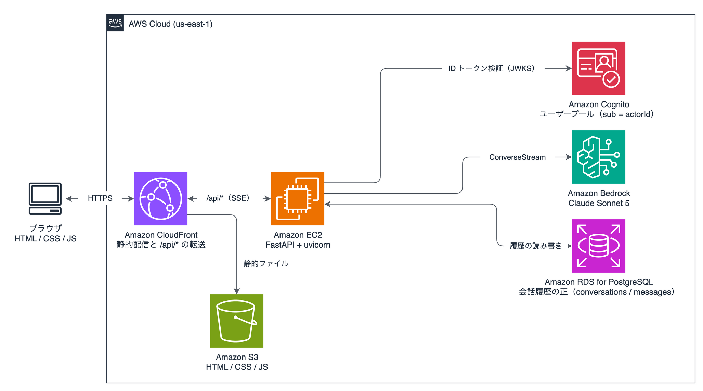
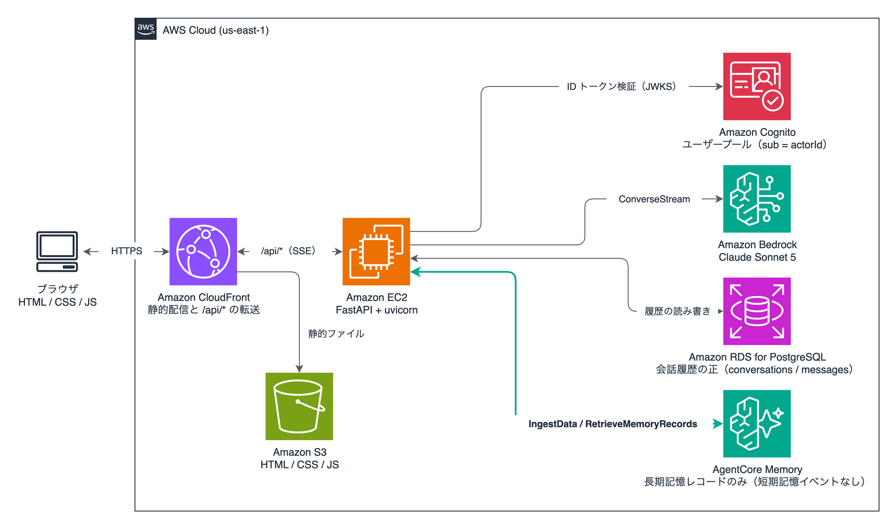

# sample-simple-AI-chatapp-with-agentcore-memory

既存の AI チャットアプリに、Amazon Bedrock AgentCore Memory の長期記憶を **IngestData API** で後付けするサンプルです。

会話履歴は RDS for PostgreSQL に持ち続け、AgentCore Memory には短期記憶イベントを作らずに長期記憶の抽出だけを任せます。Memory を導入する前に溜まっていた会話履歴も、RDS から読み出して IngestData に渡すだけで長期記憶に反映されます。

> A minimal ChatGPT-like chat app (FastAPI + vanilla HTML/CSS/JS on EC2, RDS for PostgreSQL, Amazon Cognito, Amazon Bedrock Claude Sonnet 5) that shows how to bolt AgentCore Memory long-term memory onto an existing app with the `IngestData` API, without creating short-term memory events and without changing where the conversation history lives.

解説記事（Zenn）: [AgentCore Memory の IngestData で既存の AI チャットアプリに長期記憶を後付けしてみた](https://zenn.dev/aws_japan/articles/agentcore-memory-ingestdata)

## 構成

長期記憶を足す前のアプリです。会話をセッションで分けて一覧できる、ごく一般的な画面を持ちます。



長期記憶を足した後です。差分は右下の AgentCore Memory と、EC2 上の FastAPI からそこへ伸びる線だけで、ブラウザ、CloudFront、S3、Cognito、Bedrock、RDS の間の流れは変わりません。



| コンポーネント | 役割 |
| --- | --- |
| Amazon CloudFront + S3 | フロントエンド（HTML / CSS / JS）の配信。`/api/*` だけを EC2 に転送 |
| Amazon EC2（FastAPI + uvicorn） | メッセージ送受信 API。応答は SSE でストリーミング |
| Amazon Cognito | サインアップとログイン。ID トークンの `sub` をユーザー ID と actorId に使う |
| Amazon RDS for PostgreSQL | 会話履歴の正（`conversations` / `messages` の 2 テーブル） |
| Amazon Bedrock（Claude Sonnet 5） | ConverseStream で応答生成 |
| AgentCore Memory | 長期記憶レコードのみ。IngestData で投入し、RetrieveMemoryRecords で取得 |

## ディレクトリ

```
terraform/   VPC / EC2 / RDS / Cognito / IAM / S3 / CloudFront
app/         FastAPI + 生 HTML/CSS/JS。memory.py が長期記憶統合（AGENTCORE_MEMORY_ID 未設定なら無効）
scripts/     デプロイと運用（deploy.sh, set_memory_id.sh, run_backfill.sh, show_memory_records.py ほか）
e2e/         Playwright による実環境 E2E と、スクリーンショット撮影ユーティリティ
docs/        構成図
```

長期記憶に関わるコードは次の 3 か所です。

- `app/memory.py`: IngestData と RetrieveMemoryRecords の呼び出し、system prompt への注入
- `app/main.py`: メッセージ送信 API に足した 3 行（応答前に取得、応答後に取り込み）
- `app/backfill_memory.py`: RDS の既存会話をユーザーごと会話ごとに IngestData へ渡す一括投入

## 前提

- AWS アカウントと、`us-east-1` で Claude Sonnet 5（`us.anthropic.claude-sonnet-5`）が呼び出せること
- Terraform 1.6 以上、AWS CLI v2、Session Manager プラグイン（`scripts/` が SSM 経由で EC2 を操作します）
- [uv](https://docs.astral.sh/uv/)（ローカルでスクリプトを動かす場合）
- Node.js 20 以上（E2E を動かす場合）
- boto3 1.43.90 以上（`ingest_data` の定義が入っているバージョン。EC2 側は `app/pyproject.toml` で固定済み）

## デプロイ

```bash
cd terraform
cp terraform.tfvars.example terraform.tfvars   # my_ip（自分のグローバル IP）と aws_profile を入れる
terraform init
terraform apply
cd ..
scripts/deploy.sh                               # app/ を tar.gz にして S3 経由で EC2 に配置し、systemd を再起動
```

`terraform output cloudfront_url` をブラウザで開きます。サインアップ画面からユーザーを作れます（バックエンドが `AdminCreateUser` で作成し、確認メールは送りません）。

EC2 直接の `app_url` は HTTP で、セキュリティグループにより `my_ip` と CloudFront のオリジン向けレンジからしか届きません。

## 長期記憶の有効化

1. AgentCore Memory を作ります。コンソールか、次のスクリプトで作れます。

   ```bash
   AWS_PROFILE=<profile> uv run --with boto3 scripts/create_memory_for_test.py --name memchat_memory
   ```

   戦略は User preferences（namespace `/users/{actorId}/preferences/`）と Semantic（`/users/{actorId}/facts/`）の 2 つです。`{actorId}` には Cognito の `sub` が入ります。

2. 実行中の EC2 に Memory ID を渡してアプリを再起動します（インスタンスは再作成されません）。

   ```bash
   scripts/set_memory_id.sh <memory-id>
   ```

   恒久化する場合は `terraform.tfvars` の `agentcore_memory_id` にも同じ値を入れます。

3. RDS に溜まっている既存の会話履歴を、IngestData で一括投入します。

   ```bash
   scripts/run_backfill.sh --dry-run    # 対象件数の確認
   scripts/run_backfill.sh              # 全ユーザー
   scripts/run_backfill.sh --user <sub> # 特定ユーザーのみ
   ```

4. 抽出は非同期です。数分待ってからレコードを確認します。

   ```bash
   AWS_PROFILE=<profile> uv run --with boto3 scripts/show_memory_records.py <memory-id>
   ```

有効化後は、新しい会話でも毎ターンの発言と応答が `ingest_turn_safely` で長期記憶へ渡され、応答前に `RetrieveMemoryRecords` で取得した記憶が system prompt の末尾に足されます。IngestData の失敗はログに残すだけで、会話は止めません。

## デモ用の会話履歴を入れる

長期記憶を有効にする前に、あるユーザーの過去の会話を作っておくと、Before と After の違いを見比べられます。

```bash
uv run --with httpx scripts/seed_demo_history.py \
  --base-url "$(terraform -chdir=terraform output -raw cloudfront_url)" \
  --email taro@example.com --password '<password>'
```

## E2E

Playwright で実環境に対して実行します。`BASE_URL` は必須です。

```bash
cd e2e
npm install
npx playwright install chromium
BASE_URL="$(terraform -chdir=../terraform output -raw cloudfront_url)" npx playwright test tests/chat.spec.ts
```

長期記憶ありのテスト（`tests/memory.spec.ts`）は、過去の会話で「ブラックコーヒー」の好みを話したユーザーが存在し、Memory が有効で、抽出が完了していることが前提です。

```bash
MEMORY_USER_EMAIL=taro@example.com MEMORY_USER_PASSWORD='<password>' BASE_URL=... npx playwright test tests/memory.spec.ts
```

## 検証で分かったこと

- IngestData で取り込んだ内容は短期記憶に現れません。`ListActors` は空、`ListSessions` は `ResourceNotFoundException` を返し、CloudWatch の `AWS/Bedrock-AgentCore` で Event の `CreationCount` は 0 のままでした
- 抽出の反映には投入から 1 分から 8 分ほどの幅がありました。投入直後の会話に記憶が反映されることは期待しない前提で組んでいます
- 取得系 API の階層取得には `namespacePath` を使っています。API リファレンスでは `namespace` は前方一致とされていますが、検証環境では完全一致で動きました
- Claude Sonnet 5 は `inferenceConfig.temperature` を受け付けません（`ValidationException`）。`maxTokens` だけを渡しています
- IngestData がどの料金区分で課金されるかは、執筆時点の料金表に明記がありません

## コストと片付け

EC2（t3.small）、RDS（db.t4g.micro）、NAT なしの VPC、CloudFront、Cognito、AgentCore Memory の課金が発生します。検証が終わったら削除してください。

```bash
cd terraform && terraform destroy
AWS_PROFILE=<profile> uv run --with boto3 scripts/create_memory_for_test.py --delete <memory-id>
```

Cognito ユーザープールと RDS も `terraform destroy` で消えます。RDS は `skip_final_snapshot` を有効にしているため、スナップショットは残りません。

## 注意

- これは検証用のサンプルです。EC2 直接の HTTP、Hosted UI を使わないバックエンド代行の `USER_PASSWORD_AUTH`、単一 AZ の RDS など、本番前提では見直す点があります
- Cognito のセルフサインアップは使わず、バックエンドが `AdminCreateUser` と `AdminSetUserPassword` でユーザーを作る方式にしています。組織によってはセルフサインアップ有効のプールが自動で無効化されるためです
- `terraform.tfvars`、`*.tfstate`、`tfplan` はコミット対象から外しています。自分の IP や AWS プロファイル名が入るためです

## License

MIT
